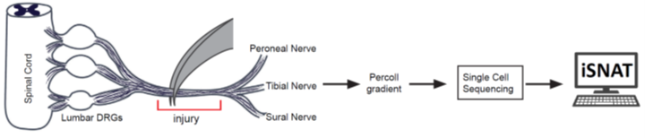

# 
 The **i**njured **S**ciatic **N**erve **AT**las (iSNAT) mouse, v1.0 

  

**Naïve sciatic nerve:** Single cell suspensions were prepared from naïve sciatic nerve trunk of male and female (C57BL/6) mice. To enrich for nerve resident immune cells, we used anti-CD45 immunopanning. CD45+ cells were subjected to scRNAseq. In parallel, non-immune cells, CD45(-) cells, were subjected to scRNAseq. The two datasets were combined.

**1 day injured sciatic nerve:** C57BL/6 mice were subjected to a mid-thigh sciatic nerve crush injury for 15 seconds with a pair of fine forceps. Single cell suspensions were prepared from sciatic nerve trunk.

**3 day injured sciatic nerve:** C57BL/6 mice were subjected to a mid-thigh sciatic nerve crush injury for 15 seconds with a pair of fine forceps. Single cell suspensions were prepared from sciatic nerve trunk.

**7 day injured sciatic nerve:** C57BL/6 mice were subjected to a mid-thigh sciatic nerve crush injury for 15 seconds with a pair of fine forceps. Single cell suspensions were prepared from sciatic nerve trunk.

**Peripheral blood mononuclear cells (PBMC):** blood was collected from adult mice by cardiac puncture. Erythrocytes were lysed and leukocytes collected. 

**scRNA-sequencing:** cells were run through the 10X Genomics pipeline and sequenced with an Illumina 6000 sequencer at a depth of 50,000 reads per cell.

Reads were mapped onto mm10 and transcripts counted through CellRanger. Data were processed through the following Seurat pipeline:

1. Filtering cells to include those with more than 500 features but less than 7500 and mitochondrial content less than 15%
2. SCTransform to normalize and scale
3. PCA dimensional reduction with the top 30 PCs used for downstream analysis
4. Shared Nearest Neighbor graphs constructed and then the original Louvain algorithm used for optimization of the modularity function to determine clusters; resolution set to 0.5
